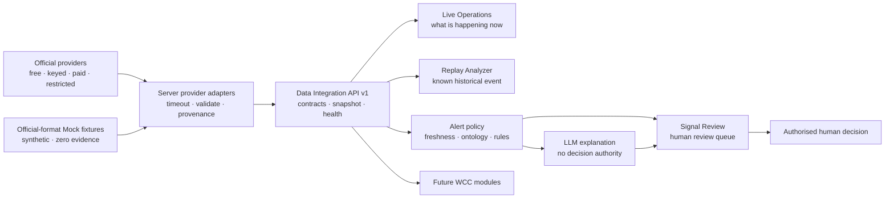

# Pōneke Movement Watch

An evidence-first modular prototype for Wellington City Council (WCC) Emergency
Management. A shared Data Integration Layer supplies current official feeds,
source health, historical movement replay and review-only alert candidates to
multiple dashboards without collapsing observations into confirmed incidents.

**Live demo:** [poneke-movement-watch.sun28long.chatgpt.site](https://poneke-movement-watch.sun28long.chatgpt.site/)

The deployed view opens on one map-first **Live Operations** workspace. **Replay Analyzer** retains
every published hour from 1–6 August 2026, including 12:00 Thursday 6 August. This is
a decision-support prototype, not an emergency dispatch or public warning system.

## Problem 05

> How might we identify and map sudden changes in pedestrian or vehicle movement
> that could indicate disruption, unsafe conditions, evacuation or loss of access?

Pōneke Movement Watch gives WCC an additional early signal. It compares an
hourly count with the same weekday and hour in recent history, maps only changes
that pass conservative gates, and shows the evidence an operator would need to
investigate. A signal never declares the cause or confirms an incident.

## Live map workspace

Live Operations places the street map, Evidence Inbox, layer controls, city context and selected
record in one workspace. The Inbox collapses; domain chips and exact source switches filter the
same normalized records. Nearby points group at broad zoom and separate at street zoom, so a high
record count does not become a wall of overlapping symbols.

Official warnings and natural-hazard
signals, sensor anomalies, or a public report aligned with a nearby sensor change can be
promoted to Signal Review. Standalone roads, planned events, flights, cruise calls, Mock and
stale records stay held or in zero-weight context. Human staff decide whether to create a case.
City context has no earned geometry, so it appears as a compact overlay and is never placed at a
fabricated map location.

## Historical replay

Replay opens with an **Investigation** selector. **April Storm · 18–22 Apr 2026** is a
read-only packaged case backed by 1,683 official historical GWRC Hilltop sensor records;
**August movement review · 1–6 Aug 2026** remains a separate WCC movement case. Staff may
also create a title, start, cutoff and primary-source draft in their browser and open it in
Replay. A local draft is not an Incident/COP, does not change evidence and performs no
external write.

The map's date, hour, previous/next, scrub and play controls move through 144
real publisher time slots. Replay speed is adjustable at `0.5×`, `1×`, `2×`
or `4×` and defaults to `1×`; it changes only the interval between time slots.
The map, signal list, evidence values and timestamp change together. The selected signal's trend compares the current count with
its 12 prior observations at the same weekday and hour; future rows are never
used, and missing rows are never interpolated or converted to zero.

The Replay layer rail is also the investigation source workspace. Staff can
include or exclude sources, filter by operator module, add a source draft, edit
its local display/routing settings and assign it to Replay Analyzer, Live
Operations or Signal Review. Drafts remain in that browser. Registry truth,
access state and the packaged replay stay locked; adding a source does not make
it connected, playable or eligible evidence.

Pause the replay and move the pointer near a visible marker to open a brief
inspection card with its place, class, travel direction, increase/decrease,
observed and expected counts, observation time and source status. Inspection is
disabled during playback and never appears for a zero-record source layer. The
signal list exposes the same evidence as the keyboard-accessible alternative.

Map navigation is not limited to fixed button steps. Use the mouse wheel or
trackpad over the map, drag the 50%–1000% zoom slider, or use the plus/minus and
reset buttons. Wheel zoom keeps the pointed area in place. After zooming, drag
the map to reach another countline and click a visible marker to select its
evidence. Reset restores both zoom and map position. **Full screen** expands the
map stage while keeping basemap, countlines, movement markers, layer state and
paused inspection aligned.

## Design principles

1. **Observation ≠ inference ≠ decision ≠ confirmed fact.** Each state has a
   distinct contract and provenance.
2. **Missing ≠ contradicting.** An absent road event or warning increases
   uncertainty; it does not disprove a movement signal.
3. **Batch replay ≠ live telemetry.** Every output exposes its observation time,
   source cadence and limitations.
4. **Geometry must be earned.** A location is published only from source
   coordinates, an exact identifier, an explicit crosswalk or a bounded spatial
   rule. Similar names are not joined.
5. **People remain in control.** The system may rank review work; it cannot close
   roads, dispatch responders, issue warnings or create confirmed facts.
6. **Privacy is removed at ingestion.** Public outputs exclude identity, street
   address, free text and internal assignment.

## Architecture



### Operator modules

| Route | Module | Purpose |
|---|---|---|
| `/live` | Live Operations | Inspect grouped evidence, map layers and zero-weight city context in one map-first workspace. |
| `/alerts` | Signal Review | Triage candidates, investigate cases, classify outcomes, prepare approval packs and inspect read-only evidence. |
| `/replay` | Replay Analyzer | Select April Storm or August movement cases, create local investigation drafts and inspect bounded historical evidence. |
| `/integration` | Data Integration | Review all 33 source contracts, access, runtime health, provider formats and integration endpoints. |
| `/ontology` | City Ontology | Trace source evidence through shared concepts, corroboration and operator decisions using the operational chain or focused graph. |
| `/setup` | Easy setup | Prepare a data source, API/MCP/A2A connection or operator defaults as a safe local draft. |

Routine screens are task-first. They show current data, status, fields and actions;
tutorial paragraphs and interaction coaching are intentionally absent. Required
truth labels—live/mock, access/cost, freshness, evidence limits and human approval—
remain compact and visible. Every module uses the same title bar, spacing and panel
hierarchy; technical APIs, the raw graph and replay evidence stay under **Advanced**
or **Evidence review**.

Signal Review uses a compact issue-details workflow: investigation content stays in
the main column while status, assignment, timing and read-only signal facts stay in
a tidy detail rail. It keeps three independent states: **Signal**, **Incident** and
**Warning**. A severe signal never confirms an incident or issues a warning.
Operators can maintain a browser-local Case/COP with an information manager, next
review, affected area, situation, confirmed and unknown items, and current actions.
Severity, source, observation time and system evidence remain read-only.

The queue has four views: **New** (`open`), **Active** (`investigating` or
`needs_action`), **Closed**, and **History** (all records). History is not a
mutable status. Staff can classify an outcome as True Positive, Benign Positive,
False Positive or Undetermined. These are browser-local human feedback labels,
not automatic training data; mock and Undetermined records are always excluded.

The Warning tab validates hazard, area, level, public action, effective/expiry/
next-update times, linked evidence, and distinct creator/approver roles before it
can prepare an `awaiting_approval` package. This demo cannot reach `issued`.
Channel rows distinguish `not_prepared` and `prepared_not_sent`; future real
adapters may add `accepted`, `failed` and `published` receipts, but a provider
receipt would still not prove that every resident saw a warning.

Case activity is a browser-local timeline, not a shared or statutory audit log.
The History queue covers records retained by the current feed and browser; it is
not a durable Council archive. A production multi-user COP requires authenticated
server-side storage, role permissions, immutable version history and authorised
publishing interfaces.

### Investigation workflow mocks

Signal Review can prepare six deterministic mock actions: WCC ticket, Replay
Analyzer handoff, WCC field dispatch, leadership notification, Civil
Defence/NEMA escalation, and a public-warning/social draft. Every result is
synthetic, remains `prepared_not_sent`, carries zero evidence weight and performs
no external write.

Replay handoffs use `available_at_only`: evidence is eligible only if it was
available by the replay cutoff. The current v1 movement rows do not carry an
individual `available_at`, so the Replay banner labels this policy as required
but not yet verifiable instead of claiming a leakage-safe case replay.

The WCC ticket mock preserves the supplied `TICKET_DETAIL` keys: `TICKET_ID`,
`INCIDENT_ADDRESS`, `LOCATION`, `LONGITUDE`, `LATITUDE`, `CREATED_AT`,
`TRIAGED_AT`, `DUE_BY_TIME`, `CURRENT_STATUS`, `CLOSED_AT`, `SERVICE_ITEM`,
`SERVICE_ITEM_L2`, `TICKET_DESCRIPTION`, `PRIORITY`, `GROUP_NAME`,
`REQUESTER_NAME`, `SOURCE_DERIVED` and `TICKET_TAGS`. Public mock output sets
requester name, exact address and unrestricted description to `null`.

Non-WCC notification shapes are demo contracts only. Real activation requires
the owning organisation's authorised interface, credentials, role permissions,
audit logging and approval workflow.

### Easy setup

Open **Setup** from the left navigation or **Add source** in Data
Integration. Complete only the visible fields and save each section. Drafts stay
in that browser. Enter a secret reference such as `METLINK_API_KEY`, never the
secret value. A saved draft has zero evidence weight until a server-side adapter,
credential, connection test and human approval are complete.

For a specific investigation, open **Replay → Layers → Add source**. This shorter
form manages the case's source basket and module assignment without modifying the
canonical registry.

Remote MCP uses Streamable HTTP. A2A starts from the provider Agent Card. The
setup screen prepares these contracts but does not call external systems.

The browser never calls providers directly. Server adapters fan out with bounded
timeouts and return a partial snapshot when one provider fails. Source
unavailable or stale is never translated to “no incident”.

### Versioned integration API

```text
GET /api/integration/v1/contracts   # all 33 provider contracts
GET /api/integration/v1/snapshot    # normalized current records + per-source health
GET /api/alerts/v1/candidates       # review-only deterministic candidates
GET /api/integration/v1/workflow-adapters   # six safe mock action contracts
POST /api/integration/v1/workflow-adapters  # prepare one mock; never dispatch
```

Each source contract carries ontology role, access/cost, raw provider format,
freshness target, spatial scope, evidence eligibility and attribution. Keyed,
paid, restricted and terms-review providers use deterministic fixtures that
preserve the verified official response shape. They are always labelled Mock,
carry zero evidence weight and cannot enter the Alert API.

| Layer | Responsibility | Main files |
|---|---|---|
| Provider registry | Classify 33 source families and official envelope contracts | `site/lib/sourceManifest.mjs`, `site/lib/providerFixtures.mjs` |
| Live adapters | Fetch permitted current APIs and normalize partial snapshots | `site/lib/liveAdapters.mjs` |
| Integration and alerts | Enforce source health, freshness, Mock gates and review-only alert policy | `site/lib/dataIntegration.mjs`, `site/worker/index.ts` |
| Ingestion | Parse source records and reject malformed observations | `ingest.py`, `validation.py` |
| Detection | Build matched seasonal baselines and apply precision gates | `detector.py`, `pipeline.py` |
| Ontology | Resolve entities, assign evidence roles and rank review cases | `ontology.py` |
| Contracts | Stable public schemas and truth-state boundaries | `contract.py` |
| I/O | Read source files and write reproducible artifacts | `io.py` |
| Builders | Produce v1 movement, v2 evidence and v3 city-semantic feeds | `scripts/build_demo.py`, `scripts/build_ontology_demo.py` |
| Interface | Live map, alert review, source inventory, historical replay and ontology | `site/app/` |
| COP artifacts | Integration-ready GeoJSON and JSON | `site/public/cop/v1/`, `site/public/cop/v2/`, `site/public/cop/v3/` |

## Wellington City Ontology

The Wellington City Ontology is the shared language between observations,
places, infrastructure, hazards and Council review. It is deliberately small:
the goal is interoperable evidence, not a universal model of the city.

| Type | Meaning | Can assert an emergency? |
|---|---|---:|
| `Observation` | A measurement, report, warning or provider record | No |
| `Entity` | A resolved place or asset such as a transport corridor | No |
| `EvidenceRelation` | A transparent link from an observation to a hypothesis | No |
| `HypothesisAssessment` | A review-ranked explanation supported by linked evidence | No |
| `Decision` | An action recorded by an authorised human role | Yes, within that authority |
| `ConfirmedFact` | A reviewed assertion with provenance | It records confirmation |
| `SourceRegistryEntry` | Access, cadence, role, privacy and resolution limits | No |
| `Place` | A maintained geographic identity such as a transport corridor | No |
| `InfrastructureAsset` | A fixed sensor or lifeline asset with source identifiers | No |
| `TimeWindow` | The interval in which records may be compared | No |
| `MovementState` | An observed increase or decrease classification | No |
| `PotentialImpact` | An investigation-only effect that evidence may indicate | No |
| `AccessState` | `unknown`, `open`, `restricted` or `closed`, with authority | Only with authoritative evidence |
| `DataLayer` | Source role, access, 2026 availability and record state | No; availability carries zero evidence by itself |

The v3 city projection adds explicit semantic relationships:

```text
observation ─measured by→ countline ─located on→ place
observation ─observed during→ time window
observation ─classified as→ movement state ─may indicate→ potential impact
potential impact ─may affect→ place
observation ─sourced from→ data layer ─describes→ movement and access domain
```

Movement alone leaves `AccessState.value` as `unknown`. Unknown is not open,
and a potential impact remains inference-only until a time-aligned authoritative
record and authorised human review establish otherwise.

### 2026 data-layer ontology

The v3 graph carries 33 typed `DataLayer` nodes. Each declares its source role,
access state, 2026 record state and evidence weight. The UI distinguishes real
records, available feeds, static/planned context, an empty activation feed,
credentials or permission requirements, paid mock-only capability, and stale
records excluded by the freshness gate.

### Ontology Dashboard

The dedicated `/ontology` page joins every source contract to its matching `DataLayer` by
`source_id` and presents a top-to-bottom hierarchy:

```text
data sources + access state
  ↓
normalize schema + align time and place
  ↓
ontology entities + relations + evidence rules
  ↓
anomaly candidates + multi-source corroboration
  ↓
Live Operations / Signal Review / Replay Analyzer
  ↓
human confirmation + authorised response
```

The five display groups are Movement & transport, Hazards & warnings, Access &
incidents, Lifelines & response, and People & demand. These are navigation groups
over the existing 28 exact ontology roles; they do not create new evidence or
change the v3 graph. Operators can filter by source, concept or destination and
see source truth, access/cost and evidence weight on every path. Signal Review is
shown only for live contracts already marked `alert_eligible`; every candidate
remains separate from an Incident and requires human review. Models and ontology
cannot issue a public warning. The 33 source-level paths are collapsed by default;
selecting a concept or destination opens the matching audit detail. Integration-only
contracts remain visible as gated context but do not become operational evidence.

Operators can also switch to the **Fusion architecture**. It presents Domain experts,
Alignment, Ontology, Calibrated fusion, Candidate & operations and Human decision as a
top-to-bottom architecture tree. Domain cards state whether they use a trainable detector,
official rules, deferred labelled text, context-only records or post-event ground truth.
Ontology remains an untrained semantic/evidence contract, consistent with the
[W3C Web Ontology Language](https://www.w3.org/OWL/) role of representing things and their
relations. Any future learned fusion must use
event-blocked out-of-fold expert predictions and independent calibration; the current view is
explicitly a prototype design with no fitted fusion weights. LLM explanation has score weight
`0`, mock records stay excluded and every output remains a human-reviewed candidate.

All six main stages stay visible; second-level nodes are collapsed initially and open with `+`,
then close with `−`. Operators can zoom from 60% to 160%, reset to 100%, or expand and collapse
all stages. Selecting a registered source, concept, module or authority updates the existing
direct-neighbour inspector with relation labels, source truth, access and evidence weight.
Visual proximity never creates evidence. The project rules are in `AGENTS.md`.

Eventfinda is a first-class planned-demand contract, not observed attendance.
Its API uses application-specific HTTP Basic credentials, so the public build
does not fetch or republish records without a key issued for this application.

Metlink bus disruption and delay capability is split into the documented
GTFS-RT products: service alerts, trip updates, vehicle positions and stop
predictions. Only bus (`route_type=3`) and school bus (`route_type=712`) belong
in the bus view. The live API needs an `x-api-key`; static GTFS remains real
schedule/network context, while the public build shows live data as credentials
required with zero records.

### Epistemic lifecycle

```text
source record
  → observation
  → linked evidence (supporting / contradicting / neutral / missing)
  → hypothesis assessment
  → authorised human decision
  → confirmed fact
```

The transitions are not automatic. Evidence units are a visible review rank,
not a probability. An LLM may summarise the structured evidence for an operator,
but it cannot change detector states, invent links, create labels or declare an
emergency.

### Entity-resolution rules

Accepted links use one of four documented methods:

- an exact provider identifier;
- an explicit maintained crosswalk;
- a source geometry that directly identifies the entity;
- a bounded spatial-near rule with stated distance and time windows.

NZTA TMS records remain unresolved because the available table has no geometry
and no verified crosswalk to WCC countline IDs. The prototype never invents a
coordinate to make a feed look mappable.

## Worked example: Centennial Highway

The replay contains a real WCC countline observation (condensed below):

```json
{
  "id": "obs:movement:48038:Car:N:2026-08-06T12:00:00",
  "entity_id": "corridor:centennial-highway",
  "transport_class": "Car",
  "observed_count": 502,
  "expected_count": 873.5,
  "robust_z": -5.331,
  "baseline": { "level": "high", "history_samples": 12 },
  "source_id": "wcc-transport-sensors"
}
```

The ontology also demonstrates the WCC `TICKET_DETAIL` adapter with
`obs:wcc-ticket:SYNTHETIC-ONTOLOGY-001`. It is visibly marked
`fixture_mode: synthetic` and contributes **zero** evidence units.

The resulting assessment is intentionally cautious (condensed below):

```json
{
  "id": "hyp:physical-access-disruption:centennial-highway",
  "epistemic_state": "inference",
  "support_units": 2,
  "contradiction_units": 0,
  "evidence_strength": "moderate",
  "evidence_state": "single_source_signal",
  "review_priority": "high",
  "missing_sources": ["nzta-road-events", "gwrc-hilltop", "metservice-cap"]
}
```

This means **investigate the corridor**, not “a disruption is confirmed.” The
missing sources remain uncertainty, the synthetic ticket does not strengthen the
case, and the decision state stays `unreviewed`.

## Movement detector

The source has counts but no verified disruption labels, so a classifier would
learn invented labels. The selected detector is a 12-week matched weekday/hour
median and median absolute deviation (MAD) baseline for each:

```text
countline × transport class × direction
```

An observation becomes an investigation candidate only when all gates pass:

- absolute robust score ≥ `4.5`;
- absolute count change ≥ `10`;
- relative change ≥ `35%`;
- matched historical samples ≥ `8`.

Missing current rows become `data_gap`; they are never converted to zero. An
explicit observed zero remains a valid measurement. The replay produces 12
signals and exposes 207 expected-but-missing groups.

Chronological model evaluation on ten high-volume countlines found the matched
seasonal median had the lowest July 2026 test MAE (`7.372`), ahead of XGBoost,
linear SVM regression and Ridge. See the [model card](docs/model-card.md) for the
split, benchmark and limitations. No classifier was trained.

## Data sources and exclusions

### Selectable map and integration layers

The map's collapsible left workspace separates three control types:

- **Street basemap** — a display-only OpenStreetMap layer;
- **Sensor coverage** — 414 WCC countline geometries;
- **Source layers** — one selectable integration layer for each of the 33
  source-registry contracts.

Only `wcc-transport-sensors` currently has real replay records. Playback stops
when that source layer is deselected. Selecting a mock, restricted, paid or
registered-only source changes the intended integration set, but it cannot add
markers, evidence or animation; its layer says `0 playable records`. Operators
can search, select all, clear all, return to the replay-only source, hide the
workspace and adjust neutral map-symbol size. Person/car pictograms are not used;
the existing direction arrows remain the movement marker.

Source layers are presentation/integration controls, not new ontology evidence.
A layer becomes playable only when a real adapter supplies time-aligned records
under the registry's access and provenance rules.

The interactive map uses OpenStreetMap raster tiles as a visual basemap, with
the required on-map attribution. It is not an evidence source and contributes
no observations or evidence weight. WCC countlines and movement signals are
projected independently over it; the sensor overlay remains visible if tiles
cannot load.

The registry contains 33 source contracts, including authoritative operator and
commercial catalogues where explicitly labelled. That does **not** mean 33 live
feeds are connected. Every source declares demo-data, access and 2026 states.

Each provider contract also declares one current operator destination:

- `Live Operations` — connected current-feed adapters only;
- `Replay Analyzer` — packaged historical/batch observations only;
- `Integration only` — Mock, gated, static, stale or not-yet-connected contracts.

Data Integration can filter by this label. Add data source requires the same
`Use in` choice. Replay defaults to Replay Analyzer sources; selecting another
label reveals its contract but does not make it playable.

| Demo status | Sources shown | Access / cost |
|---|---|---|
| **Real replay** | WCC Transport Sensors | Public source; real August 2026 batch records |
| **Mock · zero weight** | WCC ticket adapter | Council input required; synthetic fixture |
| **Mock · zero weight** | NEMA Emergency Mobile Alert | Restricted; explicit NEMA/WCC permission required; no endpoint or polygon is published |
| **Mock · zero weight** | WCC road closures | Public source; adapter preview only |
| **Mock · zero weight** | Wellington Water jobs, NEMA electricity outages, WCC events, Wellington Airport flights, CentrePort cruise schedule | Publisher terms or reuse clearance required |
| **Mock · zero weight** | Google Routes and Places APIs | API key and billing account required; monthly free caps exist, then usage pricing applies |
| **Registered only** | NZTA, GWRC, MetService, GeoNet, WREMO, emergency assets, Metlink static/realtime, Eventfinda, planned works, EAC, public EMA CAP, cameras, FENZ and KiwiRail contracts | No records from these sources affect this replay unless a permitted adapter supplies a time-aligned record |

The capability cards on the demo use synthetic examples only to show possible
ontology links. Mock cards always carry `evidence_weight: 0`. Timetables and
event schedules are planned-demand context, not proof of attendance or disruption.

### April storm backtest

The 18–22 April 2026 storm event pack is routed directly into Replay Analyzer as a backtest event.
It is a retrospective case-study contract; it does not rewind or alter live feeds.

- Training data must end before `2026-04-18T00:00:00+12:00`.
- Every replay step may use only records whose `available_at` is not later than
  that step. News, committee reports and final damage remain withheld labels.
- Compare rules, a robust anomaly detector and regularized logistic regression.
  A future stacker may use out-of-fold base predictions only.
- Mock records are excluded from training, calibration and scoring. One event
  cannot establish general accuracy.
- The pack contains 1,683 official historical Hilltop observations: two hourly
  rainfall series and five-minute Hutt River flow. Provider publication times are
  absent, so `available_at` is a conservative cadence-derived bound.
- The local official WCC files contain 209,334 movement rows for this window, but
  their at-least-monthly publication cadence limits them to retrospective outcome
  analysis. Timestamped NZTA impact records remain un-packaged.
- The later formal report's Berhampore 85.9 mm/h value and the retrieved virtual
  series peak of 77.10347 mm are preserved as distinct claims.

The event labels reference the official
[Greater Wellington committee paper](https://ltp.gw.govt.nz/assets/Documents/Documents/2026/06/Environment-and-Climate-Committee-18-June-2026-Order-Paper.pdf),
[water-monitoring article](https://www.gw.govt.nz/your-region/news/meet-greater-wellingtons-water-monitoring-team/),
[WCC reports](https://meetings.wellington.govt.nz/your-council/reports) and
[NZTA bulletin](https://www.journeys.nzta.govt.nz/traffic-bulletins/wellingtonwairarapa-regional-state-highway-status-and-weather-update-sh2-remutaka-hill-open).
The leakage guards follow scikit-learn's
[out-of-fold stacking](https://scikit-learn.org/stable/auto_examples/ensemble/plot_stack_predictors.html)
and [independent calibration](https://scikit-learn.org/stable/modules/calibration.html)
guidance.

Explicitly excluded:

- private emergency, 111-call, social-media or unlicensed commercial records;
- invented joins, coordinates or incident labels;
- static hazard layers presented as active events;
- personal identity, exact address, raw ticket text or internal assignment;
- automated dispatch, route closure, public warning or confirmation;
- an uncalibrated score presented as incident likelihood.

The complete boundary is documented in
[Evidence ontology and exclusions](docs/ontology-and-exclusions.md).

## COP feeds

The site publishes static, cacheable contracts that can slot into a shared map.

| Endpoint | Contents |
|---|---|
| `/cop/v1/movement-signals.geojson` | Mapped investigation candidates and detector evidence |
| `/cop/v1/movement-health.json` | Source cadence, coverage, gaps and limitations |
| `/cop/v1/countline-coverage.geojson` | WCC sensor countline geometry |
| `/cop/v1/movement-replay.json` | Bounded date/hour slots, signals and prior matched-hour trends |
| `/cop/v2/observations.geojson` | Privacy-safe typed observations |
| `/cop/v2/evidence-graph.json` | Entities, evidence roles, hypotheses and decision state |
| `/cop/v2/source-registry.json` | Source role, access, cadence and resolution limits |
| `/cop/v3/city-ontology.json` | Typed place, asset, time, state, impact and access relationships |
| `/cop/v4/april-storm-event-pack.json` | Leakage-safe April storm backtest contract and withheld event labels |
| `/cop/v4/april-storm-hilltop-observations.json` | 1,683 real GWRC rainfall and river-flow observations for the April replay |

Example:

```powershell
$base = "https://poneke-movement-watch.sun28long.chatgpt.site"
$case = Invoke-RestMethod "$base/cop/v2/evidence-graph.json"
$case.hypotheses | Select-Object id, review_priority, evidence_state
```

## Run locally

Requirements: Python 3.11+ and Node.js.

```powershell
python -m venv .venv
.\.venv\Scripts\pip install -e ".[test]"
.\.venv\Scripts\python -m pytest -q

Set-Location site
npm install
npm test
npm run dev
```

Open `http://localhost:3001` when the development server is ready.

## Rebuild the data artifacts

Build the v1 movement replay from the existing WCC Transport Sensors files:

```powershell
.\.venv\Scripts\python scripts\build_demo.py `
  --data-dir data\transport_sensors `
  --metadata data\countline_meta_info.csv `
  --target-at 2026-08-06T12:00:00+12:00 `
  --replay-start-at 2026-08-01T00:00:00+12:00 `
  --replay-end-at 2026-08-06T23:00:00+12:00 `
  --output-dir site\public\cop\v1
```

Build the v2 ontology replay:

```powershell
.\.venv\Scripts\python scripts\build_ontology_demo.py `
  --tickets artifacts\ontology-replay-ticket.json `
  --movement-signals site\public\cop\v1\movement-signals.geojson `
  --output-dir site\public\cop\v2 `
  --corridor-countline-id 48038
```

## Project layout

```text
├── src/movement_anomaly/       Python detector, contracts and ontology
├── scripts/                    Reproducible v1 and v2 artifact builders
├── tests/                      Detector, adapter, ontology and CLI tests
├── site/
│   ├── app/                    Web interface
│   ├── public/cop/v1/          Movement signal contracts
│   └── public/cop/v2/          Ontology and evidence contracts
├── artifacts/                  Benchmark and replay fixtures
└── docs/                       Model card, ontology rules and demo script
```

## Verification and further reading

```powershell
.\.venv\Scripts\python -m pytest -q
Set-Location site
npm test
npm run lint
```

- [Model card](docs/model-card.md)
- [Evidence ontology and exclusions](docs/ontology-and-exclusions.md)
- [Four-minute demo script](docs/demo-script.md)
- [Machine-readable benchmark](artifacts/model-benchmark.json)

## Attribution

Built for the Wellington City Council Emergency Management Impact Lab. Source
data remains subject to the terms and attribution requirements of its respective
publishers. Review WCC and provider licences before production use.
