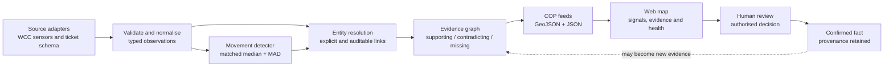

# Pōneke Movement Watch

An evidence-first prototype for Wellington City Council (WCC) Emergency
Management. It maps unusual pedestrian and vehicle counts, keeps source facts
separate from hypotheses and decisions, and publishes open Common Operating
Picture (COP) feeds that other modules can consume.

**Live demo:** [poneke-movement-watch.sun28long.chatgpt.site](https://poneke-movement-watch.sun28long.chatgpt.site/)

The deployed view opens at 12:00, Thursday 6 August 2026 and can replay every
published hour from 1–6 August 2026. It is not a live emergency alerting system.

## Problem 05

> How might we identify and map sudden changes in pedestrian or vehicle movement
> that could indicate disruption, unsafe conditions, evacuation or loss of access?

Pōneke Movement Watch gives WCC an additional early signal. It compares an
hourly count with the same weekday and hour in recent history, maps only changes
that pass conservative gates, and shows the evidence an operator would need to
investigate. A signal never declares the cause or confirms an incident.

## Historical replay

The map's date, hour, previous/next, scrub and play controls move through 144
real publisher time slots. The map, signal list, evidence values and timestamp
change together. The selected signal's trend compares the current count with
its 12 prior observations at the same weekday and hour; future rows are never
used, and missing rows are never interpolated or converted to zero.

## Design principles

1. **Observation ≠ inference ≠ decision ≠ confirmed fact.** Each state has a
   distinct contract and provenance.
2. **Missing ≠ contradicting.** An absent road event or warning increases
   uncertainty; it does not disprove a movement signal.
3. **Batch replay ≠ live telemetry.** Every output exposes its observation time,
   source cadence and limitations.
4. **Geometry must be earned.** A location is published only from source
   coordinates, an exact identifier, an explicit crosswalk or a bounded spatial
   rule. Similar names are not joined.
5. **People remain in control.** The system may rank review work; it cannot close
   roads, dispatch responders, issue warnings or create confirmed facts.
6. **Privacy is removed at ingestion.** Public outputs exclude identity, street
   address, free text and internal assignment.

## Architecture



| Layer | Responsibility | Main files |
|---|---|---|
| Ingestion | Parse source records and reject malformed observations | `ingest.py`, `validation.py` |
| Detection | Build matched seasonal baselines and apply precision gates | `detector.py`, `pipeline.py` |
| Ontology | Resolve entities, assign evidence roles and rank review cases | `ontology.py` |
| Contracts | Stable public schemas and truth-state boundaries | `contract.py` |
| I/O | Read source files and write reproducible artifacts | `io.py` |
| Builders | Produce v1 movement, v2 evidence and v3 city-semantic feeds | `scripts/build_demo.py`, `scripts/build_ontology_demo.py` |
| Interface | Canvas map, historical replay, trend panel, filters and case ledger | `site/app/` |
| COP artifacts | Integration-ready GeoJSON and JSON | `site/public/cop/v1/`, `site/public/cop/v2/`, `site/public/cop/v3/` |

## Wellington City Ontology

The Wellington City Ontology is the shared language between observations,
places, infrastructure, hazards and Council review. It is deliberately small:
the goal is interoperable evidence, not a universal model of the city.

| Type | Meaning | Can assert an emergency? |
|---|---|---:|
| `Observation` | A measurement, report, warning or provider record | No |
| `Entity` | A resolved place or asset such as a transport corridor | No |
| `EvidenceRelation` | A transparent link from an observation to a hypothesis | No |
| `HypothesisAssessment` | A review-ranked explanation supported by linked evidence | No |
| `Decision` | An action recorded by an authorised human role | Yes, within that authority |
| `ConfirmedFact` | A reviewed assertion with provenance | It records confirmation |
| `SourceRegistryEntry` | Access, cadence, role, privacy and resolution limits | No |
| `Place` | A maintained geographic identity such as a transport corridor | No |
| `InfrastructureAsset` | A fixed sensor or lifeline asset with source identifiers | No |
| `TimeWindow` | The interval in which records may be compared | No |
| `MovementState` | An observed increase or decrease classification | No |
| `PotentialImpact` | An investigation-only effect that evidence may indicate | No |
| `AccessState` | `unknown`, `open`, `restricted` or `closed`, with authority | Only with authoritative evidence |

The v3 city projection adds explicit semantic relationships:

```text
observation ─measured by→ countline ─located on→ place
observation ─observed during→ time window
observation ─classified as→ movement state ─may indicate→ potential impact
potential impact ─may affect→ place
```

Movement alone leaves `AccessState.value` as `unknown`. Unknown is not open,
and a potential impact remains inference-only until a time-aligned authoritative
record and authorised human review establish otherwise.

### Epistemic lifecycle

```text
source record
  → observation
  → linked evidence (supporting / contradicting / neutral / missing)
  → hypothesis assessment
  → authorised human decision
  → confirmed fact
```

The transitions are not automatic. Evidence units are a visible review rank,
not a probability. An LLM may summarise the structured evidence for an operator,
but it cannot change detector states, invent links, create labels or declare an
emergency.

### Entity-resolution rules

Accepted links use one of four documented methods:

- an exact provider identifier;
- an explicit maintained crosswalk;
- a source geometry that directly identifies the entity;
- a bounded spatial-near rule with stated distance and time windows.

NZTA TMS records remain unresolved because the available table has no geometry
and no verified crosswalk to WCC countline IDs. The prototype never invents a
coordinate to make a feed look mappable.

## Worked example: Centennial Highway

The replay contains a real WCC countline observation (condensed below):

```json
{
  "id": "obs:movement:48038:Car:N:2026-08-06T12:00:00",
  "entity_id": "corridor:centennial-highway",
  "transport_class": "Car",
  "observed_count": 502,
  "expected_count": 873.5,
  "robust_z": -5.331,
  "baseline": { "level": "high", "history_samples": 12 },
  "source_id": "wcc-transport-sensors"
}
```

The ontology also demonstrates the WCC `TICKET_DETAIL` adapter with
`obs:wcc-ticket:SYNTHETIC-ONTOLOGY-001`. It is visibly marked
`fixture_mode: synthetic` and contributes **zero** evidence units.

The resulting assessment is intentionally cautious (condensed below):

```json
{
  "id": "hyp:physical-access-disruption:centennial-highway",
  "epistemic_state": "inference",
  "support_units": 2,
  "contradiction_units": 0,
  "evidence_strength": "moderate",
  "evidence_state": "single_source_signal",
  "review_priority": "high",
  "missing_sources": ["nzta-road-events", "gwrc-hilltop", "metservice-cap"]
}
```

This means **investigate the corridor**, not “a disruption is confirmed.” The
missing sources remain uncertainty, the synthetic ticket does not strengthen the
case, and the decision state stays `unreviewed`.

## Movement detector

The source has counts but no verified disruption labels, so a classifier would
learn invented labels. The selected detector is a 12-week matched weekday/hour
median and median absolute deviation (MAD) baseline for each:

```text
countline × transport class × direction
```

An observation becomes an investigation candidate only when all gates pass:

- absolute robust score ≥ `4.5`;
- absolute count change ≥ `10`;
- relative change ≥ `35%`;
- matched historical samples ≥ `8`.

Missing current rows become `data_gap`; they are never converted to zero. An
explicit observed zero remains a valid measurement. The replay produces 12
signals and exposes 207 expected-but-missing groups.

Chronological model evaluation on ten high-volume countlines found the matched
seasonal median had the lowest July 2026 test MAE (`7.372`), ahead of XGBoost,
linear SVM regression and Ridge. See the [model card](docs/model-card.md) for the
split, benchmark and limitations. No classifier was trained.

## Data sources and exclusions

The interactive map uses OpenStreetMap raster tiles as a visual basemap, with
the required on-map attribution. It is not an evidence source and contributes
no observations or evidence weight. WCC countlines and movement signals are
projected independently over it; the sensor overlay remains visible if tiles
cannot load.

The registry contains 24 real, official source products. That does **not** mean
24 live feeds are connected. Every source declares both its demo-data status and
its access status.

| Demo status | Sources shown | Access / cost |
|---|---|---|
| **Real replay** | WCC Transport Sensors | Public source; real August 2026 batch records |
| **Mock · zero weight** | WCC ticket adapter | Council input required; synthetic fixture |
| **Mock · zero weight** | NEMA Emergency Mobile Alert | Restricted; explicit NEMA/WCC permission required; no endpoint or polygon is published |
| **Mock · zero weight** | WCC road closures | Public source; adapter preview only |
| **Mock · zero weight** | Wellington Water jobs, NEMA electricity outages, WCC events, Wellington Airport flights, CentrePort cruise schedule | Publisher terms or reuse clearance required |
| **Mock · zero weight** | Google Routes and Places APIs | API key and billing account required; monthly free caps exist, then usage pricing applies |
| **Registered only** | NZTA TMS/road events, GWRC Hilltop, MetService CAP, GeoNet quake/Tilde/Shaking, WREMO hubs, emergency routes/water tanks, Metlink realtime/static GTFS, NEMA CDEM boundaries | No records from these sources affect this replay |

The capability cards on the demo use synthetic examples only to show possible
ontology links. Mock cards always carry `evidence_weight: 0`. Timetables and
event schedules are planned-demand context, not proof of attendance or disruption.

Explicitly excluded:

- private emergency, 111-call, social-media or unlicensed commercial records;
- invented joins, coordinates or incident labels;
- static hazard layers presented as active events;
- personal identity, exact address, raw ticket text or internal assignment;
- automated dispatch, route closure, public warning or confirmation;
- an uncalibrated score presented as incident likelihood.

The complete boundary is documented in
[Evidence ontology and exclusions](docs/ontology-and-exclusions.md).

## COP feeds

The site publishes static, cacheable contracts that can slot into a shared map.

| Endpoint | Contents |
|---|---|
| `/cop/v1/movement-signals.geojson` | Mapped investigation candidates and detector evidence |
| `/cop/v1/movement-health.json` | Source cadence, coverage, gaps and limitations |
| `/cop/v1/countline-coverage.geojson` | WCC sensor countline geometry |
| `/cop/v1/movement-replay.json` | Bounded date/hour slots, signals and prior matched-hour trends |
| `/cop/v2/observations.geojson` | Privacy-safe typed observations |
| `/cop/v2/evidence-graph.json` | Entities, evidence roles, hypotheses and decision state |
| `/cop/v2/source-registry.json` | Source role, access, cadence and resolution limits |
| `/cop/v3/city-ontology.json` | Typed place, asset, time, state, impact and access relationships |

Example:

```powershell
$base = "https://poneke-movement-watch.sun28long.chatgpt.site"
$case = Invoke-RestMethod "$base/cop/v2/evidence-graph.json"
$case.hypotheses | Select-Object id, review_priority, evidence_state
```

## Run locally

Requirements: Python 3.11+ and Node.js.

```powershell
python -m venv .venv
.\.venv\Scripts\pip install -e ".[test]"
.\.venv\Scripts\python -m pytest -q

Set-Location site
npm install
npm test
npm run dev
```

Open `http://localhost:3001` when the development server is ready.

## Rebuild the data artifacts

Build the v1 movement replay from the existing WCC Transport Sensors files:

```powershell
.\.venv\Scripts\python scripts\build_demo.py `
  --data-dir data\transport_sensors `
  --metadata data\countline_meta_info.csv `
  --target-at 2026-08-06T12:00:00+12:00 `
  --replay-start-at 2026-08-01T00:00:00+12:00 `
  --replay-end-at 2026-08-06T23:00:00+12:00 `
  --output-dir site\public\cop\v1
```

Build the v2 ontology replay:

```powershell
.\.venv\Scripts\python scripts\build_ontology_demo.py `
  --tickets artifacts\ontology-replay-ticket.json `
  --movement-signals site\public\cop\v1\movement-signals.geojson `
  --output-dir site\public\cop\v2 `
  --corridor-countline-id 48038
```

## Project layout

```text
├── src/movement_anomaly/       Python detector, contracts and ontology
├── scripts/                    Reproducible v1 and v2 artifact builders
├── tests/                      Detector, adapter, ontology and CLI tests
├── site/
│   ├── app/                    Web interface
│   ├── public/cop/v1/          Movement signal contracts
│   └── public/cop/v2/          Ontology and evidence contracts
├── artifacts/                  Benchmark and replay fixtures
└── docs/                       Model card, ontology rules and demo script
```

## Verification and further reading

```powershell
.\.venv\Scripts\python -m pytest -q
Set-Location site
npm test
npm run lint
```

- [Model card](docs/model-card.md)
- [Evidence ontology and exclusions](docs/ontology-and-exclusions.md)
- [Four-minute demo script](docs/demo-script.md)
- [Machine-readable benchmark](artifacts/model-benchmark.json)

## Attribution

Built for the Wellington City Council Emergency Management Impact Lab. Source
data remains subject to the terms and attribution requirements of its respective
publishers. Review WCC and provider licences before production use.
