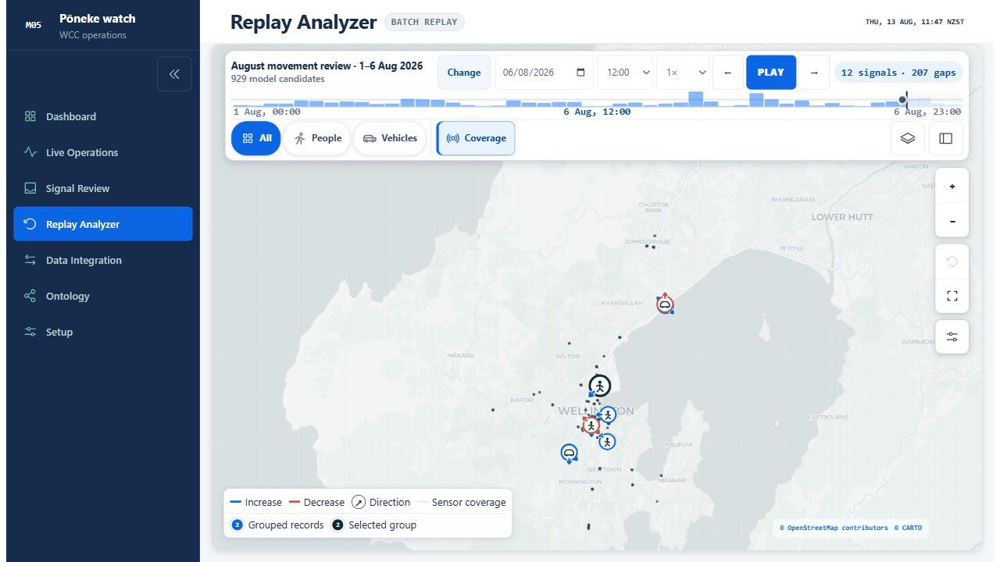
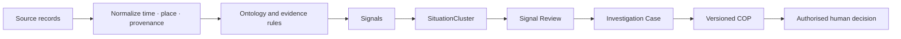
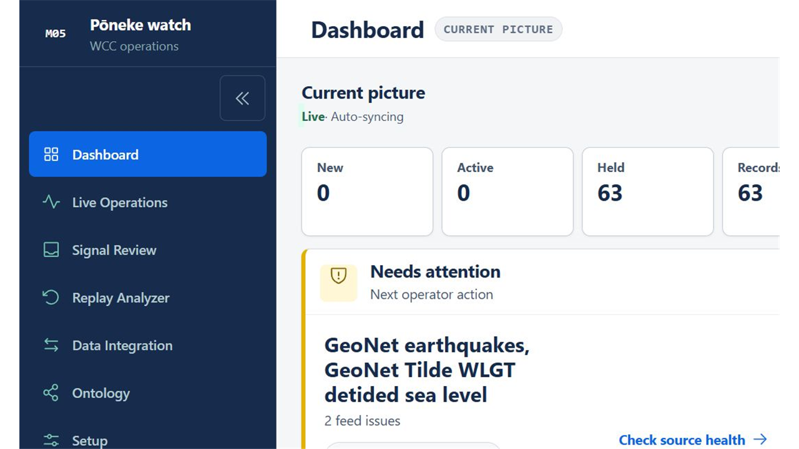
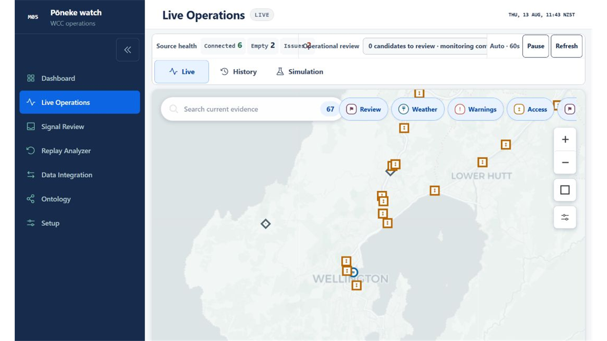
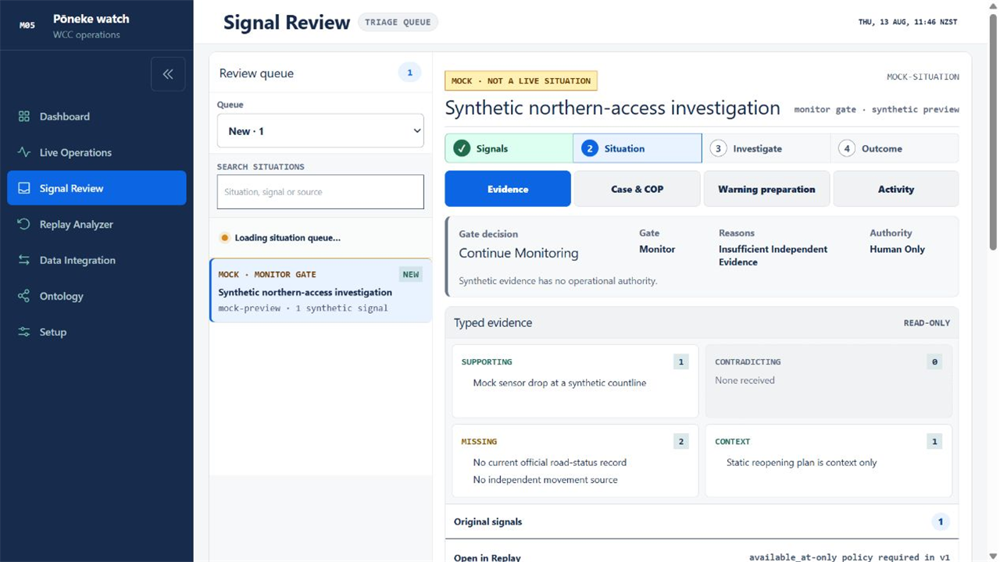
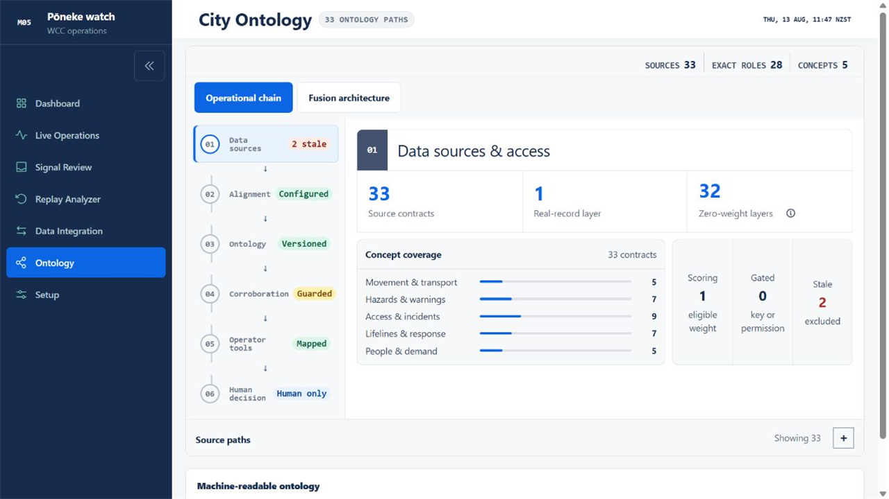
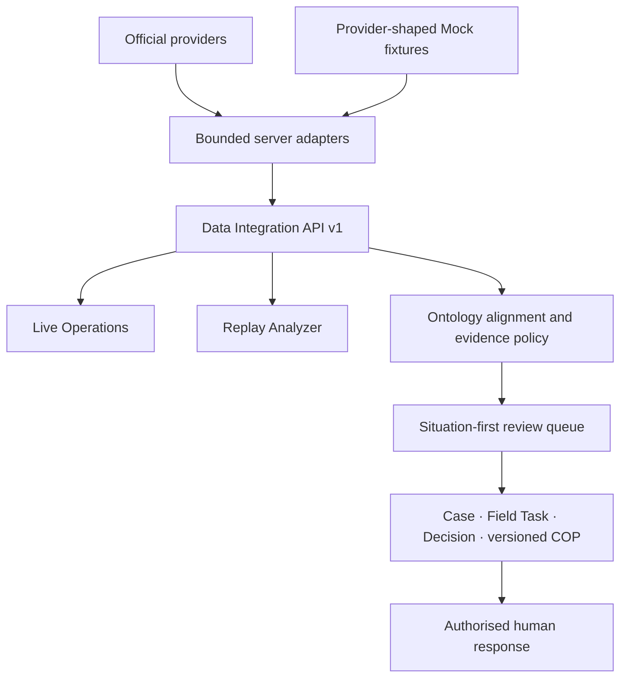

# Pōneke Movement Watch

An evidence-first emergency-operations prototype for Wellington City Council (WCC). It brings movement sensors, weather and hazard signals, reports and operational context into one review workflow without turning observations into confirmed incidents.

[Open the live demo](https://poneke-movement-watch.sun28long.chatgpt.site/) · [Documentation](docs/README.md) · [Architecture](docs/architecture.md) · [Security](SECURITY.md)

> Decision support only. The prototype does not dispatch responders, write to WCC systems, close roads or publish warnings.

<p align="center">
  
</p>

## Problem 05

> How might we identify and map sudden changes in pedestrian or vehicle movement that could indicate disruption, unsafe conditions, evacuation or loss of access?

The prototype compares each hourly count with recent observations for the same weekday, hour, transport class and direction. Conservative gates produce investigation candidates. Ontology rules then align time, place, entity, provenance and evidence roles. Staff decide whether a Situation warrants investigation.

## Operator workflow



- **Dashboard** — current queue, held observations and source health.
- **Live Operations** — map-first current evidence with Live, History and zero-authority Simulation modes.
- **Signal Review** — one queue card per Situation, typed evidence, gates, Case/COP records and human outcomes.
- **Replay Analyzer** — time-bounded April Storm and August movement investigations with selectable layers.
- **Data Integration** — 33 provider contracts, runtime health, access, cost and operator destination.
- **City Ontology** — six-stage operational chain and ontology-aware fusion design.
- **Easy setup** — browser-local source and integration drafts; nothing is activated automatically.

## Product tour

| Dashboard | Live Operations |
|---|---|
|  |  |

| Signal Review | City Ontology |
|---|---|
|  |  |

Screenshots show the public demo on 13 August 2026. Source health and current counts can change between refreshes.

## Truth and authority

| State | What this build does | Evidence authority |
|---|---|---:|
| Real replay | WCC Transport Sensors for 1–6 August; packaged GWRC Hilltop history for the April Storm | Bounded historical evidence |
| Permitted live adapter | Reads a current provider snapshot with freshness and health metadata | Only when the contract is eligible and fresh |
| Mock preview | Preserves an official/provider-shaped contract where credentials or permission are unavailable | `0` |
| Simulation | Plays six deterministic browser-local storm/flood stages | `0` |
| Registered only | Documents a source contract without inventing records | `0` |
| Human decision | Records an authorised review outcome | Human authority only |

Mock, synthetic, stale, unknown-time and retrospective-only records are excluded from alert scoring, training, calibration and accuracy claims. LLM output has evidence weight `0`; it may summarise structured evidence but cannot set incident, ticket or warning state.

See [Evidence ontology and exclusions](docs/ontology-and-exclusions.md) for the complete policy.

## Movement detector

The source contains counts but no verified disruption labels, so this build uses a transparent robust seasonal detector rather than a trained emergency classifier.

For each `countline × transport class × direction`, the detector uses a 12-week matched weekday/hour median and median absolute deviation baseline. A row becomes a candidate only when all gates pass:

- absolute robust score ≥ `4.5`;
- absolute count change ≥ `10`;
- relative change ≥ `35%`;
- at least `8` matched historical hours.

Missing rows become `data_gap`, never zero. The July 2026 chronological benchmark found the matched seasonal median had the lowest held-out MAE (`7.372`) among the tested approaches. This is forecasting error, not incident accuracy. See the [model card](docs/model-card.md).

## Architecture



The Data Integration Layer is shared by every operator module. It preserves provider shape, observation time, `available_at`, source health, access state, provenance and evidence eligibility. Failure of one adapter returns a partial snapshot; unavailable or stale never means “no incident”.

The Replay frontend is split along stable behavior boundaries:

- `MovementCanvas.tsx` — orchestration and data projections;
- `movementReplayUi.ts` — pure replay UI transitions;
- `useReplaySourceWorkspace.ts` — source selection, local drafts and icon settings;
- `useMovementReplayMap.ts` — map drawing, zoom, pan, hover and selection;
- `MovementReplayCommandBar.tsx`, `MovementReplayMapStage.tsx`, `MovementReplayEvidence.tsx` — focused views.

Detailed system, workflow, API and module boundaries are in [Architecture](docs/architecture.md).

## Historical investigations

### August movement review

- 1–6 August 2026 WCC Transport Sensors batch replay.
- 144 publisher time slots with people/vehicle class and direction.
- Selected signals expose observed, expected, change, robust score, baseline confidence and matched history.
- Playback, source layers, evidence cards and map markers remain synchronized.

### April Storm

- 18–22 April 2026 retrospective case.
- 10,098 official historical GWRC observations across rainfall and river-flow series.
- 99 grouped hydro detector episodes.
- Optional retrospective WCC movement outcomes remain off by default and have zero event-time evidence weight.
- Simulation similarity is reference retrieval only, not forecast or incident probability.

One event is a backtest case study, not a general accuracy claim.

## Integration contracts

```text
GET  /api/integration/v1/contracts
GET  /api/integration/v1/snapshot
GET  /api/alerts/v1/candidates
GET  /api/integration/v1/workflow-adapters
POST /api/integration/v1/workflow-adapters
```

The POST endpoint prepares a local Mock workflow payload; it never dispatches. WCC Ticket simulation uses the supplied WCC-shaped fields inside a separate demo envelope and always displays `MOCK · NO EXTERNAL WRITE`.

Static COP artifacts are published under `site/public/cop/` for movement, source health, ontology, evidence and April Storm replay contracts.

## Run locally

Requirements: Python 3.11+, Node.js and [`uv`](https://docs.astral.sh/uv/).

```powershell
uv sync --group dev --extra test
uv run pytest -q
uv run ruff check .

Set-Location site
npm install
npm test
npm run dev
```

Open `http://localhost:3001`.

The repository includes a small synthetic fixture so the movement artifact builder works from a clean clone without private data. Follow [Data reproduction](docs/data-reproduction.md) for the offline sample and full public WCC files.

## Verification

Verified on 13 August 2026:

- `159/159` web tests, including the production build;
- ESLint clean;
- `28/28` Python tests;
- Ruff clean;
- desktop and phone Replay QA with no console errors or horizontal page overflow.

## Documentation

Start with the [documentation index](docs/README.md):

- [Architecture and operating workflow](docs/architecture.md)
- [Evidence ontology and exclusions](docs/ontology-and-exclusions.md)
- [Movement anomaly model card](docs/model-card.md)
- [Data reproduction](docs/data-reproduction.md)
- [Remaining source inventory](docs/remaining-data-sources.md)
- [Four-minute demo](docs/demo-script.md)
- [Curated decisions](docs/decisions/README.md)
- [Security policy](SECURITY.md)

## Licence and attribution

Project code and the repository's synthetic sample are licensed under [Apache-2.0](LICENSE). Third-party data keeps its original publisher terms and attribution requirements. The map uses OpenStreetMap/CARTO tiles with on-map attribution; the basemap contributes no evidence.

Built for the Wellington City Council Emergency Management Impact Lab.
