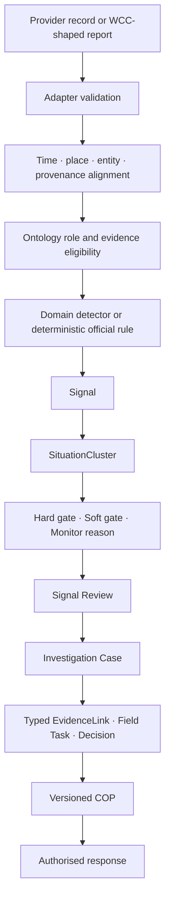

# Architecture and operating workflow

## Purpose

Pōneke Movement Watch is a modular common operating picture for investigation support. It combines permitted provider records, historical movement replay and clearly labelled Mock capability contracts while keeping observation, inference, human decision and confirmed fact separate.

The system is designed to lower review noise. Raw records do not each become tickets. Signals are grouped into a `SituationCluster`; one Situation becomes one queue item, with raw Signals available on expansion.

## End-to-end flow



### Gate policy

- **Hard gate** — required evidence or authority is absent; do not escalate.
- **Soft gate** — the Situation can be investigated, but uncertainty remains explicit.
- **Monitor** — no escalation; the queue records why, what is missing and what would change the decision.

No model or LLM may confirm an incident, dispatch staff, create an external ticket or publish a warning.

## Runtime layers

| Layer | Responsibility | Main implementation |
|---|---|---|
| Provider registry | Access, cost, provider format, cadence, source truth and operator destination | `site/lib/sourceManifest.mjs`, `site/lib/providerFixtures.mjs` |
| Live adapters | Bounded provider fetch, schema checks, provenance and partial snapshots | `site/lib/liveAdapters.mjs` |
| Integration API | Contracts, normalized current snapshot, source health and safe workflow adapters | `site/lib/dataIntegration.mjs`, `site/worker/index.ts` |
| Detection | Seasonal baselines, anomaly gates and missing-data policy | `src/movement_anomaly/detector.py`, `pipeline.py` |
| Ontology | Entity resolution, evidence roles, Situation projection and human-only decisions | `src/movement_anomaly/ontology.py` and focused ontology modules |
| Operator interface | Dashboard, Live, Signal Review, Replay, Integration, Ontology and Setup | `site/app/` |
| COP artifacts | Versioned GeoJSON/JSON feeds for movement, evidence and replay | `site/public/cop/` |

## Operator modules

| Route | Primary question | Mutation boundary |
|---|---|---|
| `/dashboard` | What needs attention now? | Navigation only |
| `/live` | What current evidence is visible and healthy? | Local filters and zero-authority exercise state |
| `/alerts` | Is this Situation worth investigation? | Browser-local Case/COP and prepared Mock actions |
| `/replay` | What was visible during a bounded investigation window? | Local source basket and investigation drafts |
| `/integration` | What contracts exist and which are usable? | Local configuration draft |
| `/ontology` | Why is a record mapped, weighted or excluded? | View and inspector state only |
| `/setup` | How would a source or external system be configured? | Browser-local draft; no activation |

## Data Integration API

```text
GET  /api/integration/v1/contracts
GET  /api/integration/v1/snapshot
GET  /api/alerts/v1/candidates
GET  /api/integration/v1/workflow-adapters
POST /api/integration/v1/workflow-adapters
```

Server adapters fan out with bounded timeouts. A provider failure returns a partial snapshot with per-source health instead of converting missing data into an all-clear. Public GET reads may be cross-origin. POST is same-origin unless the origin is explicitly configured; mutation responses never use wildcard CORS.

The workflow-adapter POST only prepares a Mock envelope. It never performs an external write.

## Ontology-aware late fusion

```text
domain experts
  ↓
time · place · entity · provenance alignment
  ↓
ontology entities · relations · evidence rules
  ↓
eligible expert outputs + deterministic official rules
  ↓
calibrated candidate
  ↓
human investigation and authorised response
```

The ontology is a versioned semantic contract, not a trainable model. Rain/water and movement may have separate domain detectors. Official closures, CAP, outage and Metlink alert records usually use deterministic status rules. Planned events, flights and cruise schedules are context, not incident evidence. News is post-event ground truth only unless historical publication eligibility is proven. LLM weight is always `0`.

There is no fitted fusion model in this prototype. Any future learned fusion must use event-blocked out-of-fold expert predictions, multiple independent events, normal-control windows and independent calibration.

## Replay architecture

The Replay workspace was decomposed at behavior boundaries without changing the public UI:

```text
MovementCanvas.tsx
├── movementReplayUi.ts             pure UI state transitions
├── useReplaySourceWorkspace.ts     source selection and local drafts
├── useMovementReplayMap.ts         canvas, zoom, pan, hover and selection
├── MovementReplayCommandBar.tsx    investigation and playback controls
├── MovementReplayMapStage.tsx      map, layers and inspection overlay
└── MovementReplayEvidence.tsx      evidence drawer and source onboarding
```

Timeline changes stop playback and clear transient inspection. Filter changes preserve playback but clear transient evidence. Source changes declare whether playback must stop. These policies are covered by focused reducer tests instead of being implicit across many event handlers.

Replay time uses the selected investigation window. Evidence is eligible only when its observation and availability policy permit it at the playhead. Missing rows are not interpolated or converted to zero. Static context remains visibly distinct from current-hour or snapshot records.

## Investigation records

| Record | Purpose |
|---|---|
| `Signal` | One detector or official-rule output with source and time |
| `SituationCluster` | Nearby, time-aligned Signals grouped for review; no causal claim |
| `EvidenceLink` | Typed supporting, contradicting, missing or context relationship |
| `InvestigationCase` | Human-owned investigation state |
| `FieldTask` | Proposed or recorded field verification task |
| `Decision` | Human action and rationale |
| `COPVersion` | Append-only snapshot of the shared situation picture |

WCC Ticket is a contract simulation only. Provider-shaped changes can be demonstrated inbound and outbound, but every action is labelled `MOCK · NO EXTERNAL WRITE` or `Prepared — not sent`. WCC-shaped fields stay inside a separate demo envelope so internal Situation, Case and evidence records do not masquerade as WCC fields.

## Security and privacy

- CSP, clickjacking, MIME-sniffing, referrer and browser-permission headers are configured in the web application.
- Ticket identity, exact address, unrestricted free text and internal assignment are removed from public outputs.
- Restricted, paid, keyed and terms-review contracts do not become evidence merely because a fixture exists.
- Browser-local drafts are not shared audit records or training labels.
- Production requires authentication, role permissions, durable storage, immutable history, credential management and authorised publishing interfaces.

See [Security](../SECURITY.md) and [Evidence ontology and exclusions](ontology-and-exclusions.md).

## Verification baseline

Verified 13 August 2026:

- 159 web tests and production build;
- ESLint clean;
- 28 Python tests;
- Ruff clean;
- desktop and phone Replay QA with no console errors or horizontal page overflow.

The large frontend bundle warning remains a performance backlog item; it is not represented as a completed optimization.
